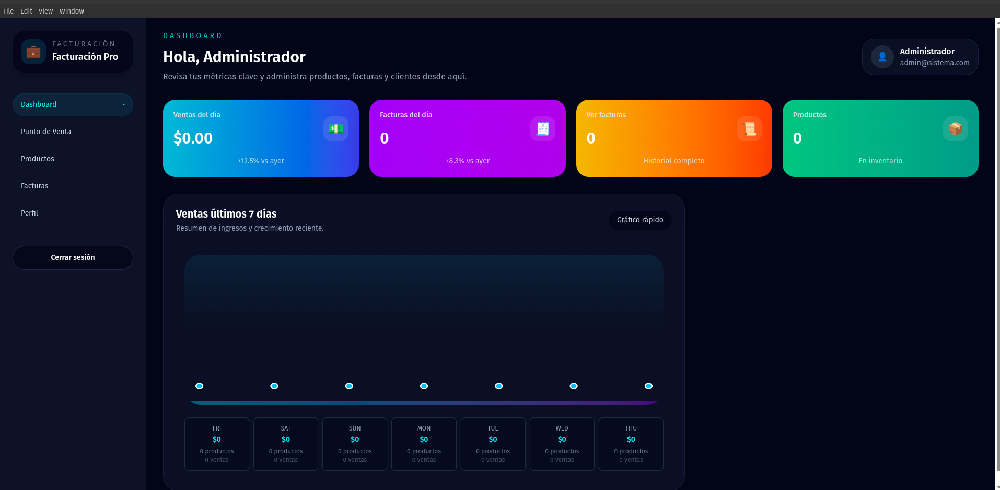
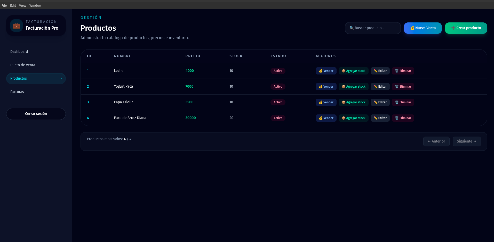
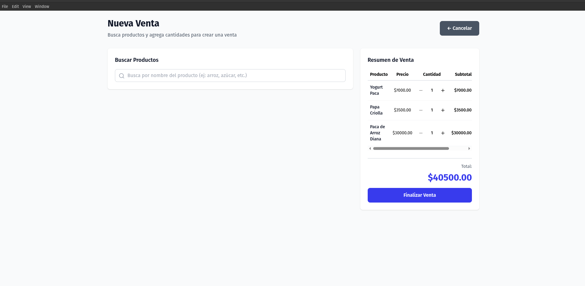
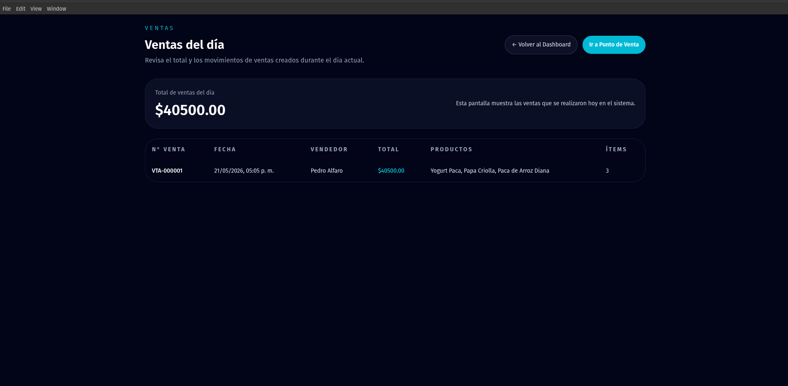
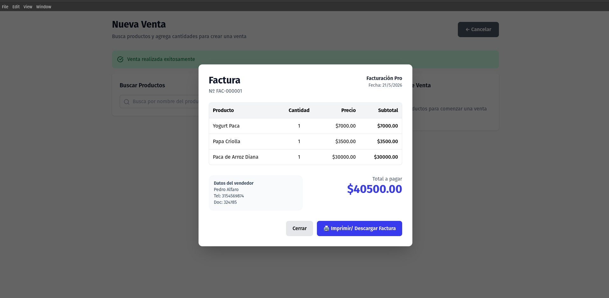
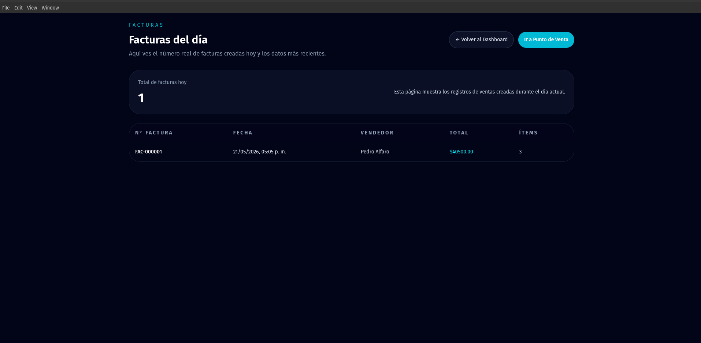
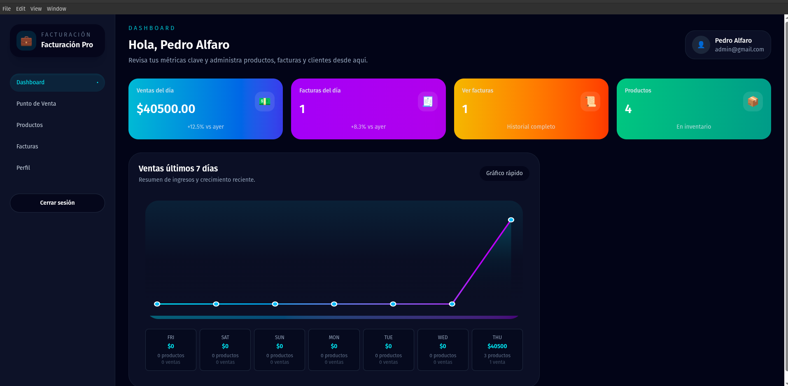

# Market Pro - Inventory & Invoicing Desktop App

Modern invoicing and inventory management desktop application built with Electron, React and FastAPI.

Perfect for small businesses, local stores and entrepreneurs looking for a fast and professional solution for managing products, sales and inventory.

---

## Features

* Product management
* Inventory control
* Sales registration
* Authentication system
* Modern UI
* Desktop application for Windows

---

## Technologies

* Electron
* React
* TypeScript
* FastAPI
* SQLite / PostgreSQL

---

## Screenshots

### Dashboard

### Products

### Sales

### DaySales

### Facture

### DayFactures

### History

---

## Video Demo

Coming soon.
https://youtu.be/K3wGum3I_v4?si=Ij0T26UIX9n2njz0

---

## Purchase Full Version

👉 Buy the full application here:

https://rojoandres1.gumroad.com/l/vryjkt

Includes:

* Windows installer
* Future updates
* Basic support
* Full application

---

## License

This repository is for showcase purposes only.
Commercial distribution is protected.
